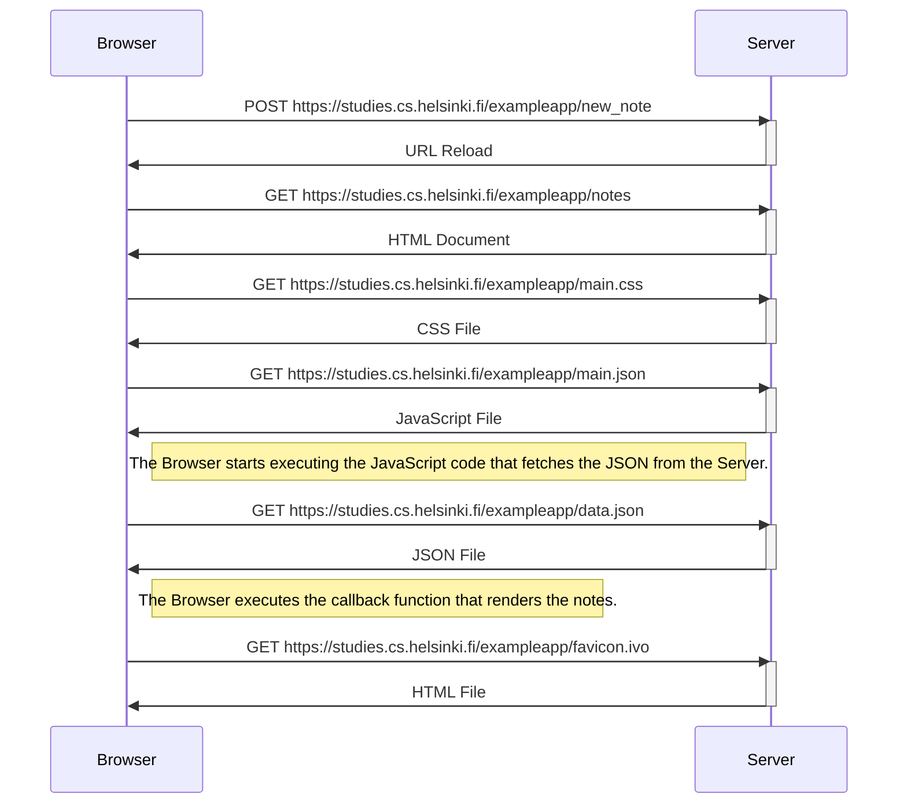

```mermaid
sequenceDiagram
    participant Browser
    participant Server
    
    Browser->>Server: POST https://studies.cs.helsinki.fi/exampleapp/new_note
    Activate Server
    Server->>Browser: URL Reload
    Deactivate Server

    Browser->>Server: GET https://studies.cs.helsinki.fi/exampleapp/notes
    Activate Server
    Server->>Browser: HTML Document
    Deactivate Server

    Browser->>Server: GET https://studies.cs.helsinki.fi/exampleapp/main.css
    Activate Server
    Server->>Browser: CSS File
    Deactivate Server

    Browser->>Server: GET https://studies.cs.helsinki.fi/exampleapp/main.json
    Activate Server
    Server->>Browser: JavaScript File
    Deactivate Server
    
    Note right of Browser: The Browser starts executing the JavaScript code that fetches the JSON from the Server.

    Browser->>Server: GET https://studies.cs.helsinki.fi/exampleapp/data.json
    Activate Server
    Server->>Browser: JSON File
    Deactivate Server

    Note right of Browser: The Browser executes the callback function that renders the notes.

    Browser->>Server: GET https://studies.cs.helsinki.fi/exampleapp/favicon.ivo
    Activate Server
    Server->>Browser: HTML File
    Deactivate Server
```
